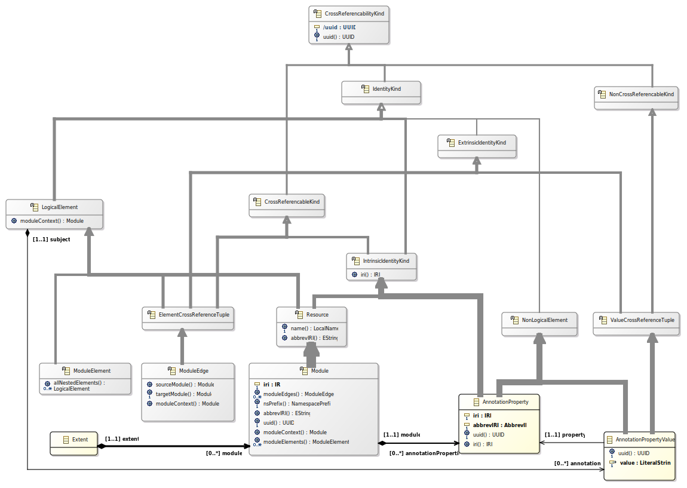



# Ontological Modeling

OML is designed to support rigorous Model-Based Systems Engineering (MBSE) methodologies
based on using [W3C] standards and recommendations as the logical semantics
of MBSE modeling languages and of MBSE models expressed in such languages.

## Modeling Language vs. Model expressed in a Modeling Language

The distinction between a modeling language and a model comes from [OMG Specifications],
specifically [OMG MOF 2.5.1], which stipulates that a modeling architecture involves
a minimum of two modeling levels -- the so-called `M1` (the model level) and `M2` (the metamodel level).
[OMG Specifications] define syntactic criteria for specifying
what it means for a `model` at `M1` to `conform` to a `modeling language` at `M2`.
Typically, `conformance` criteria defined in [OMG Specifications] involve logical
constraints written in [OMG OCL] where the constraint variables range over instances of `M2` metaclasses
defined in a metamodel for that modeling language and where constraint expressions refer to features and relationships
defined in that metamodel (e.g., operations, properties, associations).

In practice, verifying conformance of a model for a given modeling language defined in an [OMG Specification]
typically requires using a modeling tool that implements the conformance criteria defined in that specification.
Historically, this paradigm has been unsatisfactory for several reasons:
- Some conformance criteria are described semi-formally in English because they can't be expressed in [OMG OCL]
- In the abscence of positive and negative conformance test suites covering all syntactic constructs defined,
  there are legitimate doubts about the sufficiency of conformance criteria defined in an [OMG Specification].
- The correspondence between an [OMG OCL] syntactic conformance constraint defined in an [OMG Specification] and its
  implementation is typically opaque. Without official conformance test suites, the correctness of an implementation
  is uncertain.
 
To support rigorous MBSE methodologies, OML defines conformance based on precise notions of
ontological consistency and satisfiability across arbitrary levels of domain-specific modeling languages.
In OML, a domain-specific modeling language is defined by an OML Bundle; which, from an OMG perspective,
corresponds to a metamodel for that modeling language.
The taxonomy of OML Concept(s) and of OML EntityRelationship(s) define the conceptual vocabulary
for that modeling language. From an OMG perspective, this is similar to the taxonomies of metaclasses
and of associations in a corresponding metamodel define the conceptual vocabulary of that modeling language.

The main difference with respect to defining a conceptual vocabulary between OML and a [OMG MOF 2.5.1] metamodel is
in the logical formalism of that conceptual vocabulary. In OML, the logical formalism stems
from the semantics of mapping an OML Module to an [OWL2-DL] ontology with [SWRL] rules. 
For an [OMG MOF 2.5.1] metamodel, the logical formalism is partially described in clause 15 (CMOF Abstract Semantics),
which itself depends on several [OMG Specifications] including but not limited to [OMG UML 2.5] and [OMG OCL].
The differences in logical formalism shave significant practical implications:
- With OML, any [OWL2-DL] compliant reasoner that supports [SWRL] rules (e.g., [Pellet]) 
  is adequate for reasoning about OML Module(s), including but not limited to providing automated answers to all 
  [OWL2 Semantic Inference Problems] including but not limited to classification, entailment, satisfiability, 
  consistency, instance checking and boolean conjunctive query answering. 
- With [OMG MOF 2.5.1], the semi-formal character of the [OMG MOF 2.5.1 Abstract Semantics] makes
  no mention of any practically useful reasoning problem about modeling. This means that [OMG Specifications] provide
  a marginal value for rigorous modeling.

In addition to grounding the semantics of modeling in the formalism of[OWL2-DL] ontologies with [SWRL] rules,
OML also provides a formalization of the `instanceOf` relationship between an M1-level `model` written 
in a modeling language and an M2-level `metamodel` for that modeling language. 
According to the [OMG MOF 2.5.1 Abstract Semantics], every element in a `model` of a modeling language 
is an `instance` of a classifier defined in the CMOF `metamodel` for that modeling language[^1]:
- A `ClassInstance` is a model element that is an `instanceOf` a `Class` in the metamodel.
- An `AssociationInstance` is a model element that is an `instanceOf` an `Association` in the metamodel.
 
[^1] Although the [OMG MOF 2.5.1] specification defines the syntax for two kinds of metamodels, EMOF (clause 12)
and CMOF (clause 14), the specification only defines the abstract semantics of CMOF metamodels (clause 15); 
the abstract semantics of EMOF metamodels is unspecified.

Instead of representing the relationship between a model and a metamodel via `instanceOf` relationships among
different kinds of syntactic constructs as in [OMG MOF 2.5.1 Abstract Semantics], OML represents the relationship
between a model `M1`and a metamodel `M2` via subsumption relationships:
- Modeling an `instanceOf` an OML Concept defined in `M2` involves defining an OML ConceptSpecialization in `M1`
  of that OML Concept in `M2`.
- Modeling an `instanceOf` an OML EntityRelationship defined in `M2` for a domain `D` in `M1` and a range `R` in `M1`
  can be done in two ways:
  - Explicitly if the OML EntityRelationship is an OML ReifiedRelationship. This involves 
    an OML ReifiedRelationshipSpecializationAxiom in `M1`
    for a new specialized OML ReifiedRelationship in `M1` with domain `D` and range `R`.
  - Implicitly via an OML EntityRestrictionAxiom in `M1` about that OML EntityRelationship 
    for the restricted domain `D` and restricted range `R`.
- Modeling an `instanceOf` an OML EntityScalarDataProperty defined in `M2` for a domain `D` in `M1` and a literal value `V` 
  involves defining an OML EntityScalarDataPropertyParticularRestrictionAxiom in `M1` for
  that OML DataRelationshipFromEntity for the specific restricted domain `D` and specific value `V`.
Additionally, OML further requires all subsumption relationships specified in model `M1` as restrictions
on a metamodel `M2` to be a monotonic refinement of the vocabulary of `M2`. This means:
- The [OWL2-DL] ontology with [SWRL] rules corresponding to an `M1` model must be logically consistent and satisfiable
  with the [OWL2-DL] ontology with [SWRL] rules corresponding to the `M2` metamodel that `M1` is an `instanceOf`.
- Every OML Term of some kind in `M1` must be subsumed by at least one OML Term of the same kind in `M2`.

From an MBSE perspective, a `model` in OML is an OML Module whose semantics is defined by
its mapping to an [OWL2-DL Ontology] with [SWRL] rules. This applies to different kinds
of `models` used in MBSE including but not limited to a metamodel like [OMG UML 2.5], 
a profile like [OMG SysML 1.4], a model library like SysML's QUDV and SysML's ISO-80000 library 
as well as user-defined models. From a pragmatic perspective, the semantics of 
an OML Module mapped from a UML/SysML `model` includes a formalization of SysML's `PropertySpecificType`;
a mechanism for describing a context-specific role that a SysML Block plays in the context of a system. 

The OML specification makes structural and semantic distinctions among three kinds of models,
each kind is an OML Module that maps to a particular usage of [OWL2-DL Ontology] with [SWRL] rules.

## Identification

OML uses the same identification principle than OWL2 for identifying OML Module(s) (i.e. [OWL2-DL Ontologies])
and their elements. For additional precision, OML includes support for specifying that an OML EntityDataProperty
has the semantics of an `IdentityCriteria` in the sense of [OntoClean] conveyed by the mapping to an [OWL2 Key Axiom].

## Annotations

OML Annotation(s) and OML AnnotationProperty(-ies) correspond, respectively, to [OWL2 Annotation] and [OWL2 AnnotationProperty].
Like [OWL2-DL], an OML Annotation is a non-logical axiom. Whereas [OWL2-DL] supports multiple levels of annotations (an [OWL2 Annotation] can be annotated);
OML supports a single level of annotation: an OML Annotation can only annotate an OML TerminologyThing subject.

An OML AnnotationProperty is identified by a combination of an abbreviated IRI and of an IRI. This allows using existing annotation vocabularies without explicitly importing them
(e.g., http://purl.org/dc/elements/1.1/).

## Ontologies

The notions of OML Module, OML Annotation, OML AnnotationProperty are described in the following figure:



An OML Module maps to an [OWL2-DL Ontology] with a set of [OWL2 Axioms] and [SWRL] rules.
On first order, OML distinguishes between two kinds of OML Module(s):

- An OML TerminologyBox corresponds to a so-called [Tbox Ontology].

  There are two kinds of OML TerminologyBox(es):
  
  - `OpenWorldDefinitions`
  
  	This is for defining the vocabulary of a particular domain or for specializing a domain-specific vocabulary
  	for describing a usage of that vocabulary for modeling the types of parts and relationships that will be used
  	to in a `ClosedWorldDesignations` for designating distinct uses of these part & relationship types.
  	
  - `ClosedWorldDesignations`
  
  	This is for designating the individual parts and connections that constitute the topological structure of a system
  	described using `OpenWorldDefinitions` vocabularies.

  The key difference between these two kinds pertains the mapping to [OWL2 Class] of an OML ConceptualEntity and on an OML Structure.
  
  - In `OpenWorldDefinitions`, the mapping is per the usual open world semantics of [OWL2-DL] 
  	because the intent is precisely that of classifying an arbitrary set of individuals (or none).

  - In `ClosedWorldDesignations`, the mapping involves axioms that, effectively, force a singleton [OWL2 NamedIndividual]
  to represent a designated instance identified by the values of the OML EntityDataProperty(-ies) with `isIdentityCriteria=true`. This ensures
  that each designated instance is properly identified according to the criteria specified in the vocabulary and that topological and structural
  relationships at the instance level involve designated instances only. In other words, the topology and structure of a particular system
  is explicitly modeled in a `ClosedWorldDesignations` whereas it is only partially constrained in an `OpenWorldDefinitions`. 
  
  This distinction between the mapping of OML ConceptualEntity(-ies) and OML Structure(s) to [OWL2 Classes] provides opportunities
  for applying formal methods techniques to explore and refine possible topologies & structures of systems from partial descriptions.
  These techniques involve so-called *model finders*, such as:
  - the SAT-based [Kodkod] model finder for [Alloy]
  - the SMT-based [Formula] tool
  - in an unconventional albeit limited way, [OWL2-DL] reasoners such as [Pellet]
  
- An OML DesignationBox corresponds to a so-called [Abox Ontology].

	This is for describing a particular state of affairs about the individual designations of 
	the parts & relationships that describe the topology & structure of a particular system.
	A state of affairs is typically described via values of OML DataProperties.

## Organizing & Modularizing OML TerminologyBox(es)

OML represents a careful use of a subset of [OWL2-DL] for collaborative authoring of vocabularies, designations and descriptions as [OWL2 Ontologies].
OML is generally biased towards partitionning the use of the vocabulary of [OWL2 Axioms] for cognitively different purposes in vocabulary management.
  
For example:
  
  - Disjointness is used only for representing the semantic commitment to the [Unique Name Assumption] in the scope of an OML Bundle only.
  
  - Cardinality restrictions are used only for representing the semantic commitment to singletons in `ClosedWorldDesignations` OML TerminologyBox(es).
   
  - Named individuals are restricted to OML DescriptionBox(es) for representing intrinsically distinguishable and distinct individuals
    in the `real world` based on the semantics of [OWL2 Key Axiom](s) and the values of 
    the domain-specific `isIdentityCriteria=true` OML EntityDataProperty(-ies) asserted for them.   

This restricted use of the [OWL2-DL] vocabulary is reflected in the distinction among two kind of OML TerminologyBox(es) mapped to [OWL2 Ontologies]:

- An OML TerminologyGraph where the emphasis is on defining a domain-specific vocabulary or system-specific designations.

  Conceptually, it is useful to think about OML Concept(s) as defining the `nouns` of a vocabulary or of a system designation
  and about OML EntityRelationship(s) as defining `verbs` of a vocabulary or of a system designation. OML restricts a `verb` to
  be a directed relationship between a subject and an object that can be a `noun` or a reified `verb` (i.e. OML ReifiedRelationship).
 
  The purpose of an OML TerminologyGraph is to specify what is possible to describe in a domain-specific vocabulary or a system-specific
  designation and to support doing so in a modular, open-world fashion. That is, by defining an OML TerminologyGraph as an extension of another
  so that the former can use the vocabulary of the latter. Ontologies with open world semantics are essential for reusability and extensibility.
  This emphasis is reflected in the vocabulary of OML TerminologyGraph(s) in that their mapping to [OWL2 Ontologies] does not include any
  disjointness axioms for OML ConceptualEntity(-ies) -- i.e., [OWL2 Disjoint Classes Axiom] and [OWL2 Disjoint Union of Class Expressions Axiom].
  The principle behind this limitation is that a disjointness axiom represents an implicit closed-world assumption that all the distinctions
  of a particular [OWL2 Class] are known and can therefore be stated explicitly in such an axiom. OML provides support for this limited form
  of closed-world assumptions in OML Bundle(s).
  
  Although OML supports specialization of OML ConceptualEntities; it is generally preferable to convey context-specific restrictions on
  the domain/range of OML EntityRelationship(s) via restriction axioms rather than specialization, for example using OML EntityRestrictionAxiom(s)
  (existential or universal) thanks to the vocabulary of [OWL2 Object Property Restiction]. The rationale for this is that specialization
  augments the size of the vocabulary in a way that can dilute its meaning and utility. For example, consider a fititious domain-specific vocabulary 
  of vehicles sketched in OML textual concrete syntax as follows:
  
  ```OML
  open terminology http://www.example.org/vehicles {
 	abstract concept Vehicle
  	abstract concept Bicycle
  	abstract concept Car
  	abstract concept Train
  	Bicycle extendsConcept Vehicle
  	Car extendsConcept Vehicle
  	Train extendsConcept Vehicle
  }
  ```
  
  This vocabulary defines four OML Concept(s), `Vehicle`, `Bicycle`, `Car` and `Train`, organized in a simple taxonomy: `Vehicle` is a general
  concept with 3 specializations: `Bicycle`, `Car` and `Train`. From an OML perspective, the specializations are considered superfluous because
  there is no ontological distinction among them. In practice, it means that such a vocabulary does not provide users any support for
  answering legitimate questions about the intended purpose of the vocabulary nor what it actually means 
  (e.g., What is the difference between a `Bicycle` and a `Car`? What differentiates between a `Car` and a `Vehicle`?). 
  
  In this example, all four OML Concept(s) are defined nominally -- they are distinguishable only by their IRI.
  There is no ontologically significant distinction among them; which is a legitimate concern for rigorous modeling
  because the vocabulary provides no useful guidance for proper usage. To address this problem, the vocabulary would have
  to be augmented to include OML EntityRelationship(s) and/or OML DataRelationshipFromEntity(-ies) such that each OML Concept
  would have a distinguishable signature based on these relationships. 
  
  An OML TerminologyGraph vocabulary could be mapped to UML/SysML using class/block diagrams by mapping an OML Concept to a UML/SysML Class or Block
  and by mapping an OML EntityRelationship to a UML/SysML association. Note that an OML UnreifiedRelationship would map to a UML/SysML Association
  but an OML ReifiedRelationship would have to be mapped to a UML/SysML AssociationClass since it can play the role of a domain or a range 
  for an OML EntityRelationship of some kind that would be mapped to a UML/SysML Association or AssociationClass.
   Unfortunately, encoding equivalent restrictions
  for OML EntityRelationship(s) modeled as UML/SysML Associations of some kind requires specialization to use the UML mechanisms
  of association end subsetting and redefinition for encoding the intended context-specific restrictions. Regardless of mapping to UML/SysML,
  specializing OML EntityRelationship(s) for context-specific restrictions can lead to a substantial increase in the size of the domain-specific
  vocabulary because non-trivial domains typically require capturing many such restrictions. 
  
  Conversely, it is generally preferable to avoid superfluous specialization of OML Concept(s). In OML, a specialized OML Concept is superfluous
  unless the specialized OML Concept is involved in some kind of restriction on an OML EntityRelationship whose domain or range includes
  the parent OML Concept. For example, suppose that a fiticious domain-specific vocabulary of vehicles is defined as follows:
  
  TODO: elaborate a possible refinement...
  
  TODO: explain that non-superflous definitions provide important guidance for users because the signature of relationships
  associates to the OML Concept one or more patterns of usage.

- An OML Bundle where the emphasis is on explicitly encoding commitments to disjunctions among OML Concept(s) defined in one or more bundled OML TerminologyBox(es).

  Manually specifying [OWL2 Disjoint Classes Axiom] and [OWL2 Disjoint Union of Class Expressions Axiom] can be tedious and
  error-prone; particularly when these axioms refer to [OWL2 Classes] defined across multiple domain-specific [OWL2 Ontologies] that are 
  under revision control by different domain-specific subject-matter experts. It is generally difficult to predict what impact a particular
  change in an [OWL2 Ontology] will have on disjointness axioms previously asserted. In OML, it is the responsibility of an author
  to specify the scope of the bundle -- i.e., identifying the OML TerminologyBox(es) to include in the bundle. The OML TerminologyBundleStatement(s)
  specifying disjointness axioms among OML Concept(s) declared directly or indirectly in the bundled OML TerminologyBox(es) could be authored
  manually; however, OML provides tools for inferring such axioms based on the [Unique Name Assumption] that concrete OML Concept(s) 
  that do not have any specialization specify distinct things in the bundled domain-specific vocabularies.
  
  Since OML relies extensively on encoding ontological distinctions among concepts using relationship restrictions of various kinds,
  OML does not provide support for asserting the disjointness of OML EntityRelationship(s) or OML DataRelationship(s) because doing
  so would significantly increase the cognitive difficulty in understanding the resulting vocabulary due to the counter-intuitive interactions
  between relationship restrictions and relationship disjointness.
  
### Canonical Parsing

OML provides a strong guarantee that any structurally significant difference between OML Module(s) ontoloties is precisely reflected
in the syntactical differences of their representation in the OML normalized relational schema table serialization without superfluous change noise.
In practice, this strong guarantee is important to enable multiple teams to collaborate on developing OML Module ontologies
for authoring and evolving multiple inter-related domain-specific vocabularies; for bundling them to reflect commitments to domain-specific distinctions
among OML Concept(s); for using such bundles for describing the topology and structure of systems and for describing particular 
configurations in particular state of affairs of such topologies & structures with named individuals identified according to all relevant identity criteria.

This strong guarantee is the result of lessons learned in managing ontologies where partitioning the use of ontologies as described above is important
but practically insufficient for managing change because of the serialization variability of [OWL2 Ontologies]. The [OWL2 Structural Specification] is
remarkable in that it one of very few machine-readable language standards where the specification for what it means to parse the concrete syntax representation
of a document into an internal representation in that language is based on a notion of structural equivalence where differences in concrete syntax representation
matter if and only if they result in structural differences. Unfortunately, the standard concrete syntaxes for [OWL2] such as [OWL2 RDF/XML] and [OWL2 XML] 
allow considerable variability in the concrete syntax representation of a given [OWL2 Ontology]. In practice, this means that it is difficult for users
to use version control systems like `git` to manage changes to ontologies. Indeed, concrete syntax serialization differences like shuffling the order
in which axioms are represented have no structural significance because an [OWL2 Ontology] is a set of axioms -- the order is structurally irrelevant;
however, any concrete syntax representation has to choose a particular order. 

OML avoids this problem thanks to an OML normalized tabular schema that is designed to ensure that an OML Module ontology has a unique concrete
syntax representation as sorted rows for the OML normalized tabular schema. This ensures that any difference in the concrete syntax representation
(i.e., adding, deleting, changing a particular row) reflects a structurally significant difference with respect to the OML specification. 
Despite this difference, the [concrete schema definitions of OML](GLOSSARY.md#oml-schema-concrete-glossary))
plays a similar role for OML than the simplified UML class diagrams do for the [OWL2 Structural Specification].
Since an OML Module maps to an [OWL2 Ontology] and that a given [OWL2 Ontology] can be serialized
in multiple documents that are structurally equivalent to each other, it follows
that a given OML Module is structurally equivalent to all the serializations of ontology documents
that are structurally equivalent to its corresponding [OWL2 Ontology].
This propety enables a change management strategy that leverages both OML and OWL2 for their respective strengths:

- OML normalized tabular schema representations of OML Module ontologies are kept under version control (e.g. `git`)
   
  This ensures that any difference reported by `git diff` is structurally significant in OML.
  
- Using the appropriate OML tools, OML Module ontologies are converted to their corresponding [OWL2 Ontology] representations with [SWRL] rules.

  This enables using standards-based tools for querying and reasoning (e.g., [Pellet]). 
  
  However, the results of such reasoning (e.g., entailments, unsatisfiability, inconsistency) need to be mapped back to their corresponding OML representation
  to help users remain productively focused on using OML instead of forcing them to become cognizant in the details of the mapping. 
