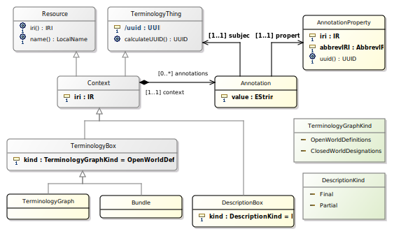



# Ontological Modeling

OML is designed to frame a rigorous approach for Model-Based Systems Engineering (MBSE).
From an MBSE perspective, a `model` in OML is an OML Context whose semantics is defined by
its mapping to an [OWL2-DL Ontology] with [SWRL] rules. This applies to different kinds
of `models` used in MBSE including but not limited to a metamodel like [OMG UML 2.5], 
a profile like [OMG SysML 1.4], a model library like SysML's QUDV and SysML's ISO-80000 library 
as well as user-defined models. From a pragmatic perspective, the semantics of 
an OML Context mapped from a UML/SysML `model` includes a formalization of SysML's `PropertySpecificType`;
a mechanism for describing a context-specific role that a SysML Block plays in the context of a system. 

The OML specification makes structural and semantic distinctions among three kinds of models,
each kind is an OML Context that maps to a particular usage of [OWL2-DL Ontology] with [SWRL] rules.

## Identification

OML uses the same identification principle than OWL2 for identifying OML Context(s) (i.e. [OWL2-DL Ontologies])
and their elements. For additional precision, OML includes support for specifying that an OML EntityDataProperty
has the semantics of an `IdentityCriteria` in the sense of [OntoClean] conveyed by the mapping to an [OWL2 Key Axiom].

## Annotations

OML Annotation(s) and OML AnnotationProperty(-ies) correspond, respectively, to [OWL2 Annotation] and [OWL2 AnnotationProperty].
Like [OWL2-DL], an OML Annotation is a non-logical axiom. Whereas [OWL2-DL] supports multiple levels of annotations (an [OWL2 Annotation] can be annotated);
OML supports a single level of annotation: an OML Annotation can only annotate an OML TerminologyThing subject.

An OML AnnotationProperty is identified by a combination of an abbreviated IRI and of an IRI. This allows using existing annotation vocabularies without explicitly importing them
(e.g., http://purl.org/dc/elements/1.1/).

## Ontologies

The notions of OML Context, OML Annotation, OML AnnotationProperty are described in the following figure:

An OML Context maps to an [OWL2-DL Ontology] with a set of [OWL2 Axioms] and [SWRL] rules.
On first order, OML distinguishes between two kinds of OML Context(s):

- An OML TerminologyBox corresponds to a so-called [Tbox Ontology].

  There are two kinds of OML TerminologyBox(es):
  - `OpenWorldDefinitions`
  
  	This is for defining the vocabulary of a particular domain.
  	
  - `ClosedWorldDesignations`
  
  	This is for designating the individual parts and connections that constitute the topological structure of a system
  	described using domain-specific vocabularies.

- An OML DesignationBox corresponds to a so-called [Abox Ontology].

	This is for describing a particular state of affairs of the parts and connections 
	of a system described in a `ClosedWorldDesignations` OML TerminologyBox.

### Canonical Parsing

The [OWL2 Structural Specification] defines the [Canonical Parsing of OWL2 Ontologies] 
from the concrete syntax representation of an ontology document 
(e.g., [OWL2 Functional Syntax], [OWL2 RDF/XML] and [OWL2 XML]) 
to an [OWL2 Ontology] that is an instance of the abstract syntax defined by the [OWL2 Structural Specification].
This canonical parsing process is specified in terms of the criteria 
of [OWL2 Structural Equivalence] and of the UML class diagrams that define the [OWL2 Structural Specification].

OML adopts a similar strategy; however, in lieu of using a very simple form UML class diagrams, 
the OML specification is the basis for generating a normalized relational database schema
(see the [concrete schema definitions of OML](GLOSSARY.md#oml-schema-concrete-glossary)). 

This normalized schema is designed to ensure that structurally equivalent OML Context(s) 
have identical representations in terms of instance data of the normalized schema.
Since an OML Context maps to an [OWL2 Ontology] and that a given [OWL2 Ontology] can be serialized
in multiple documents that are structurally equivalent to each other, it follows
that a given OML Context is structurally equivalent to all the serializations of ontology documents
that are structurally equivalent to its corresponding [OWL2 Ontology].
This propety is particularly important for change management because the OML normalized schema table
serialization ensures that any change in serialization is structurally significant by definition.
In contrast, change management with the serialization of OML Context(s) based on their mapping to [OWL2 Ontologies] 
would involve comparing serializations of ontology documents; such as [OWL2 RDF/XML], which is notorious for
allowing syntactically different serializations for structurally equivalent ontologies. 
This suggests that it is practically preferable to use the OML normalized schema table serialization
under change management because any change in serialization is structurally significant and use OML converters
to produce [OWL2 Ontology] documents as needed for [OWL2-DL] reasoning. 
