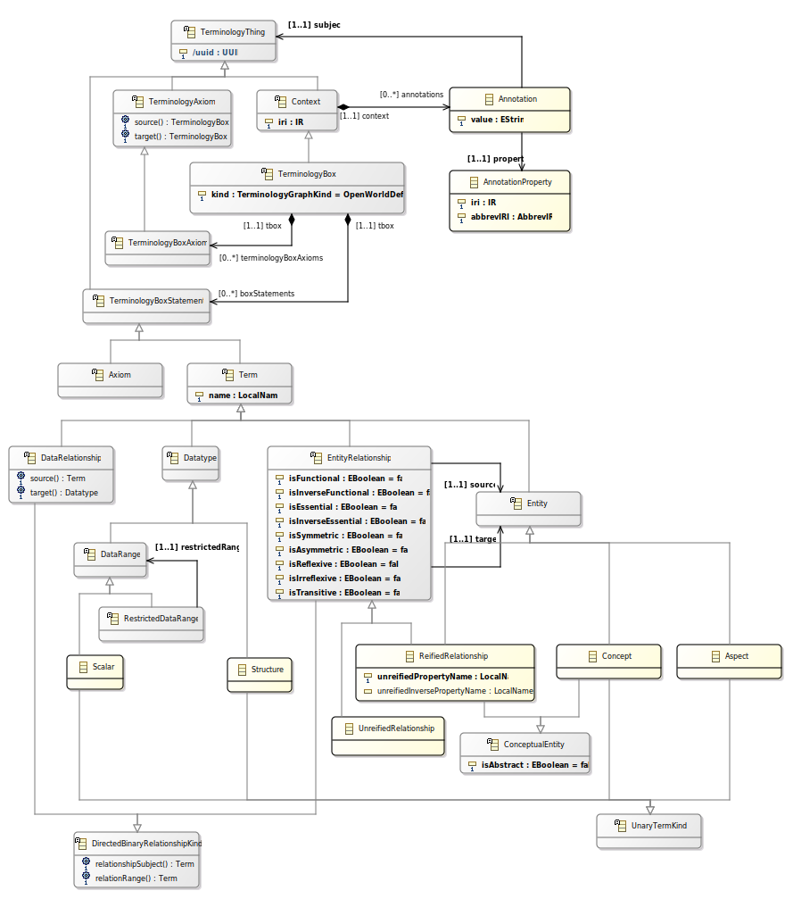



# Ontological Modeling Language Specification

## Abstract

The Ontological Modeling Language, OML, is a thin vocabulary extension of [W3C]'s [OWL 2 Web Ontology Language] 
designed to support precise and modular reasoning about descriptive systems engineering models. An OML Context
maps to an [OWL2-DL Ontology] with [SWRL] rules both structurally and semantically. Structurally, an [OWL2-DL Ontology] provides 
classes, properties, individuals and data values that are represented in Semantic Web documents. These constructs
form the basis of the [OWL2-DL]+[SWRL] mapping of an OML Context whose corresponding constructs include
OML Entity, OML EntityRelationship, OML Datatype,  OML DataProperty and OML TerminologyInstanceAssertion.

## Key properties of the semantics of OML in [OWL2-DL]+[SWRL].

The semantics of an OML Context is defined by its mapping to a corresponding [OWL2-DL Ontology] with [SWRL] rules.
OML is designed to provide support for modular and collaborative practices of domain-specific Model-Based Systems Engineering
with an emphasis on precision and rigor thanks to the following key features of OML:
- For collaborative modeling, every OML Context model that maps to a well-formed [OWL2-DL Ontology] with [SWRL] rules has a unique 
  in the OML tabular interchange representation. Differences in the OML tabular interchange representation (e.g., with `git diff`)
  are isomorphic to differences in the structure of corresponding OML Contexts.
  
- For authoring a rigorous domain-specific vocabulary in MBSE as an OML TerminologyBox, OML relies on reasoning with [OWL2-DL] with [SWRL] rules
  for verifying essential characteristics, including the satisfiability of every OML ConceptualEntity with respect to
  the [OWL2 Axioms] encoding the mapping of each OML Term and OML Axiom defined in the OML TerminologyBox.

- For organizing rigorous domain-specific vocabularies in a modular, reusable fashion, OML distinguishes between two intended
  semantics of a particular OML TerminologyBox: open-world vs. closed-world. This distinction simplifies the problem
  of organizing [OWL2-DL Ontologies] with [SWRL] rules in a modular fashion such that reasoning over 
  modular [OWL2-DL Ontologies] with [SWRL] rules can be correspondingly organized in a modular fashion 
  where the inferences computed from sub-modules can be reused for sound [OWL2-DL] reasoning with [SWRL] rules 
  over an aggregating super module.
  
- For MBSE specifically, OML formalizes the notion of composite structure defined in the [OMG UML 2.5], which is
  extensively used in the practice of MBSE with the [OMG SysML 1.4] in so-called SysML Block Definition Diagrams (BDDs)
  that, in OML, correspond to an open-world OML TerminologyBox description of the possible structure of a system vs. 
  SysML Internal Block Diagrams (IBDs) or SysML Parametric Diagrams (PARs) that, in OML, correspond to a closed-world
  OML TerminologyBox designation of a particular system structure topology. In SysML, IBDs and PARs reflect
  and implicit [UNA] that, in OML, is encoded via two distinct mechanisms: closed OML TerminologyBox where
  the semantics of each OML ConceptualEntity is restricted to be a singleton individual and OML DescriptionBox where
  a particular configuration of singleton individuals describe the topology of the structure of a particular system
  in a given state of affairs.
  
- For modeling guidance, repair, verification and variation analysis, OML is designed to facilitate using reasoning techniques
  [OWL2-DL] with [SWRL] rules for completing partial models (i.e., OML DesignationBox) where, for example, unsatisfiability precisely
  indicates missing essential information such as a value for an `isIdentityCriteria=true` or existentially restricted OML EntityDataProperty or
  a missing OML TerminologyInstanceAssertion for the domain, range or triple of an essential or existentially-restricted OML EntityRelationship.

- For facilitating the understanding of reasoning errors such as unsatisfiability and inconsistency, OML provides support
  for adopting a rigorous modeling methodology where human systems engineers have the unique responsibility for authoring essential descriptions
  that cannot be mechanically inferred and where automated reasoning have the unique responsibility for inferring derivable, non-essential
  descriptions without any possibility of inferring what should be human-authored essential descriptions. The key mechanism
  for this hinges on the fact that every OML ConceptualEntity (i.e., an OML Concept or an OML ReifiedRelationship) defined 
  in the vocabulary of an OML TerminologyBox is, by definition, an essential definition. That is, the only mechanism
  to describe an instance of an OML ConceptualEntity is an OML ConceptualEntitySingletonInstance, which maps to an [OWL2 NamedIndividual].
  Since [OWL2-DL] reasoners cannot create a fresh [OWL2 NamedIndividual], it is therefore impossible for an [OWL2-DL] reasoner with [SWRL] rules
  to conjure a new OML ConceptualEntitySingletonInstance. On the other hand, an OML UnreifiedRelationship maps to an [OWL2 ObjectProperty],
  an instance of which is an OML UnreifiedRelationshipInstanceTuple that corresponds to a triple (see [OWL2 RDF-based Semantic Conditions on Property Vocabulary])
  that any [OWL2-DL] reasoner with [SWRL] rules can infer as part of computing the entailments of an [OWL2-DL Ontology].
  Thus, by partitioning the methodological use of OML ConceptualEntitySingletonInstance for representing human-authored system descriptions
  and that of OML UnreifiedRelationshipInstanceTuple for automated-reasoning entailments about such descriptions, a rigorous methodology
  can use OML to ensure clear provenance about each axiom implicated in a reasoner-provided explanation about an unsatisfiability or inconsistency result.

- For managing changes in the evolving descriptions and analyses of complex systems, 
  the separation between essential descriptions (e.g., OML ConceptualEntitySingletonInstance) and derivable descriptions (e.g., OML UnreifiedRelationshipInstanceTuple)
  reduces the burden of change management to that of the essential descriptions and also provides a useful mechanism to assess the impact of changes
  to essential descriptions have on entailed non-essential descriptions. This impact analysis is particularly useful in conjunction with 
  verification properties asserted using [SWRL] rules where the characteristics of an OML EntityRelationship such as transitivity,
  reflexivity and asymetry provide useful constraints for encoding characteristics of the domain-specific vocabulary or of that of a description
  of a particular system topology.
  
## Vocabularies for Model-Based Systems Engineering (MBSE)

### What is a vocabulary?

Quote from [W3C's SemanticWeb summary:](https://www.w3.org/standards/semanticweb/ontology#summary "What is a vocabulary?")
> On the Semantic Web, vocabularies define the concepts and relationships (also referred to as “terms”) used to describe and represent an area of concern. 
Vocabularies are used to classify the terms that can be used in a particular application, characterize possible relationships, and define possible constraints on using those terms. 
In practice, vocabularies can be very complex (with several thousands of terms) or very simple (describing one or two concepts only). 
There is no clear division between what is referred to as “vocabularies” and “ontologies”. 
The trend is to use the word “ontology” for more complex, and possibly quite formal collection of terms, 
whereas “vocabulary” is used when such strict formalism is not necessarily used or only in a very loose sense. 
Vocabularies are the basic building blocks for inference techniques on the Semantic Web.

### The OML vocabulary is a subset of the [OWL2-DL] vocabulary for domain-specific MBSE

Defining a controlled vocabulary of a particular domain of systems engineering facilitates communication among stakeholders.
In OML, a controlled vocabulary is an OML TerminologyBox, the semantics of which is defined by its mapping to a corresponding [OWL2-DL Ontology].
An OML TerminologyBox defines OML Terms and specifies constraints among them via OML Axioms.
OML Terms and OML Axioms map to patterns involving [OWL2 Entities] and [OWL2 Axioms].

a collection of OML Terms and OML Axioms; both of which map to [OWL2 Entities] and [OWL2 Axioms].

OML supports this activity with the notion of an OML TerminologyBox for defining each OML Term used in the controlled vocabulary
and specifying their semantics via OML Axioms.

OML defines four core abstractions to support defining domain-specific
The core constructs of OML are:
  - [Terms](./Terms.md) such as concepts and relationships
  - [Axioms](./GLOSSARY.md#Axiom) about terms
  - [Terminologies](./GLOSSARY.md#Terminology), collections of terms & axioms

